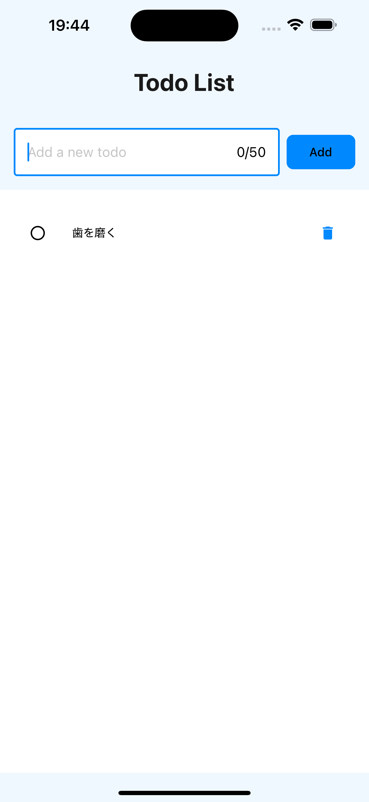

# Todo ReactNative App

React NativeとExpoを使用して開発されたシンプルなTodoアプリケーションです。

## スクリーンショット



## 機能

- Todoアイテムの追加
- Todoアイテムの完了/未完了の切り替え
- Todoアイテムの削除
- データの永続化（AsyncStorageを使用）

## 技術スタック

- React Native
- Expo
- TypeScript
- React Native Paper（UIコンポーネント）
- AsyncStorage（データ永続化）

## プロジェクト構造

```
app/
├── components/  # UIコンポーネント
├── hooks/      # カスタムフック
├── screens/    # 画面コンポーネント
├── types/      # 型定義
└── utils/      # ユーティリティ関数
```

## 開発環境のセットアップ

1. リポジトリをクローン

```bash
git clone [repository-url]
```

2. 依存関係のインストール

```bash
npm install
```

3. 開発サーバーの起動

```bash
npm start
```

## 利用可能なスクリプト

- `npm start`: Expo開発サーバーを起動
- `npm run android`: Androidエミュレータで実行
- `npm run ios`: iOSシミュレータで実行
- `npm run web`: Webブラウザで実行
- `npm run lint`: ESLintによるコードチェック
- `npm run format`: Prettierによるコードフォーマット
- `npm run type-check`: TypeScriptの型チェック

## 品質管理

- ESLint: コード品質の維持
- Prettier: コードフォーマットの統一
- TypeScript: 型安全性の確保
- Husky: Gitフックによる品質管理の自動化

## ライセンス

MIT License
